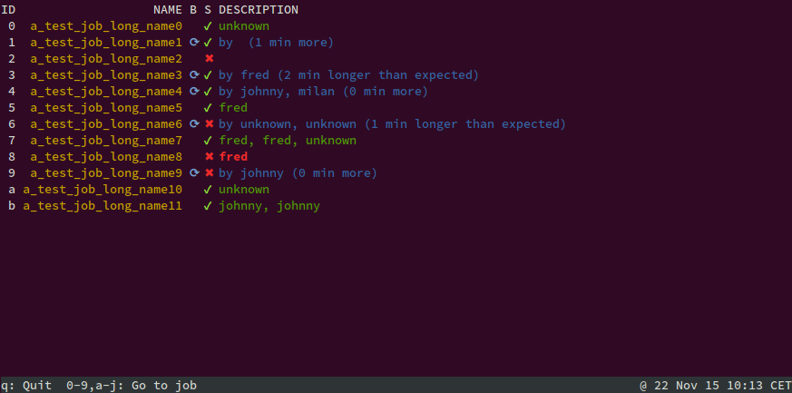

# Jenkins Ping

Command line for Jenkins pipeline overview

## How to run

Please run application with `--diff` to see all options.

Application has 2 modes of running ncurses-like (*advanced* like) and dump-to-console (the *simple* mode). Application will try to activate the advanced one and will fallback to simple one if it detects the advanced is not possible (for example out of an IDE). You can also force the simple mode of working via adequate command line switch.

## Highly experimental

This app is in early stages of development. It *works for me* but it *might not work for you* (if not, I am sorry, but this is just yet another a hobby project of mine).
